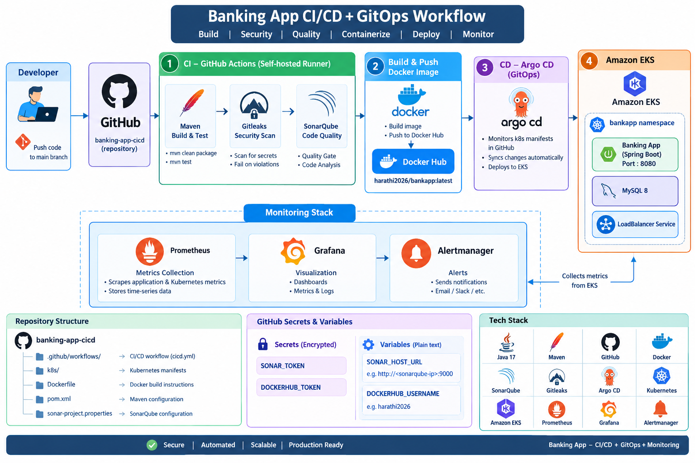

# CI/CD + SonarQube + Docker + Kubernetes + Argo CD + Prometheus + Grafana monitoring 
### for reference check 51 banking app cicd continution for 50.docx file i attached in that in repository




```bash
                         BANKING APP CI/CD + GITOPS
                                  │
                                  ▼
                         ┌─────────────────┐
                         │     GitHub      │
                         │ banking-app-cicd│
                         └────────┬────────┘
                                  │
                         git push to main
                                  │
                                  ▼
                    ┌─────────────────────────┐
                    │     GitHub Actions      │
                    │    Self-hosted Runner   │
                    └────────────┬────────────┘
                                 │
              ┌──────────────────┼──────────────────┐
              │                  │                  │
              ▼                  ▼                  ▼
        ┌──────────┐       ┌──────────┐      ┌────────────┐
        │  Maven   │       │ Gitleaks │      │ SonarQube  │
        │ Build    │       │ Security │      │ Code       │
        │ + Test   │       │ Scan     │      │ Quality    │
        └────┬─────┘       └────┬─────┘      └─────┬──────┘
             │                  │                   │
             └──────────────────┼───────────────────┘
                                │
                                ▼
                       ┌─────────────────┐
                       │  Docker Build   │
                       └────────┬────────┘
                                │
                                ▼
                       ┌─────────────────┐
                       │   Docker Hub    │
                       │ bankapp:latest  │
                       └────────┬────────┘
                                │
                                │
                ┌───────────────┴───────────────┐
                │                               │
                ▼                               ▼
       ┌────────────────┐              ┌────────────────┐
       │ GitHub k8s/    │              │     Argo CD    │
       │ manifests      │─────────────►│    GitOps      │
       └────────────────┘              └───────┬────────┘
                                               │
                                               ▼
                                      ┌─────────────────┐
                                      │   Amazon EKS    │
                                      │                 │
                                      │   bankapp        │
                                      │   MySQL          │
                                      └────────┬────────┘
                                               │
                         ┌─────────────────────┼───────────────────┐
                         │                     │                   │
                         ▼                     ▼                   ▼
                   ┌───────────┐        ┌───────────┐       ┌────────────┐
                   │Prometheus │───────►│  Grafana  │       │Alertmanager│
                   │  Metrics  │        │ Dashboard │       │   Alerts   │
                   └───────────┘        └───────────┘       └────────────┘


```


## 1. Create and Clone the GitHub Repository
Create an empty repository in GitHub with the name:
**Banking-app-cicd**
In D drive create folder for the project :with this name  banking-app-cicd
In vs code open 
```bash
Open VS Code → select open folder select the path where you have create a folder in D drive with name banking-app-cicd Terminal → Select Gitbash  check Are in correct path

or not (/d/harathi/banking-app-cicd)now clone the project using below command

git clone https://github.com/harathi-mutyam/Github-Actions-Project.git

ls

cd Github-Actions-Project/

```

## 2. Push Local Code to GitHub (optional here)
**Open Git Bash in the project directory.**
```bash
# Remove the existing Git configuration:

rm -rf .git
# Initialize Git:

git init

# Rename the branch to main:

git branch -M main

# Add the .gitignore file:

git add .gitignore

# Commit the changes:

git commit -m "Add gitignore to project"

# Add all project files:

git add .

# Commit the project:

git commit -m "project"

# Add the GitHub remote repository:

git remote add origin https://github.com/harathi-mutyam/banking-app-cicd.git

# Push the code:

git push -f origin main
```
## 3. Create the AWS Security Group

**Open the AWS Console → EC2 → Security Groups.**
```bash
#Create a security group named:

githubaction_sg


 ```
####  Configure the required inbound rules:
######  Security Group Inbound Rules

| Type        | Protocol | Port       | Source          |
|-------------|----------|------------|-----------------|
| SMTPS       | TCP      | 465        | Anywhere IPv4   |
| Custom TCP  | TCP      | 587        | Anywhere IPv4   |
| Custom TCP  | TCP      | 3000–11000 | Anywhere IPv4   |
| HTTP        | TCP      | 80         | Anywhere IPv4   |
| HTTPS       | TCP      | 443        | Anywhere IPv4   |
| SSH         | TCP      | 22         | My IP           |

## 4. Create the GitHub Actions Self-Hosted Runner

**Create an EC2 instance with the following configuration:**

```bash
•	Name: Runner 
•	OS: Ubuntu 
•	Instance type: c7i-flex.large 
•	Key pair: github-key 
•	Security Group: githubaction_sg 
•	Storage: 25 GB
```
**Connect to the instance using Git Bash:**
```bash
ssh -i Downloads/github-key.pem ubuntu@<public-ip-of-runner-ec2-instance>

# Update the system:

sudo apt update

# Set the hostname:

sudo hostnamectl set-hostname runner
/bin/bash

```
## 5. Configure the GitHub Self-Hosted Runner

**Open your GitHub repository:**

**Actions → Runners → Self Hosted Runner New self-hosted runner → Linux**
```bash
Copy the commands displayed by GitHub and execute them on the Runner EC2 instance.
```
```bash
For reference:

copy those commandsopen Runner gitbash-->paste those commands and run itAgain go back to git hub repository in browser copy the download the latest runner package command--> paste it in Runner gitbash and run it -->again open in browser github respository copy the extract the installer command--> paste it in the Runner gitbash and run it

After downloading and extracting the runner package:
```
```bash
cd actions-runner

# Check the files:

ls

If required, remove the downloaded tar file:

rm actions-runner-linux-x64-2.322.0.tar.gz

ls
```
```bash

For Reference:

Now Configure the Runner: open github repository in browser copy the command related to create Runner & start the Configuration experience paste it in EC2 Runner Gitbash & run it

Press Enter for Default here type: Press Enter-->Enter-->Type Runner1 -->Provide Labels:  here type self-hosted 
Enter the name of work folder: Press enter key here for default
```

**Configure the runner using the command provided by GitHub.**
```bash
When prompted:
•	Press Enter for the default values where appropriate. 
•	Enter Runner1 as the runner name. 
•	Enter self-hosted as the label. 
•	Press Enter to use the default work folder.

ls

```
```bash
for reference: Open github repository in browseropen same repository in duplicate browser--> select settings -->actionsrunners--> Now you can see Runner1 is in offline 

```
**open EC2 runner gitbash  --> run the below command**
```bash

# Start the runner:

./run.sh

```
**You should see a message similar to:**
```bash
Connected to GitHub

Listening for Jobs

The runner is now connected to GitHub and ready to execute GitHub Actions jobs.

```
For referece: Open github repository in browser Refresh the page -->You can observe status changed to **idle or active**

## 6. Install Maven on the Runner

Check the cicd.yaml file in:

**.github/workflows/cicd.yaml**

```bash
Since the workflow uses Maven, Maven must be installed on the Runner EC2 instance.
```
**Open one more gitbash for installation purpose.**


Connect to the Runner:


```bash
ssh -i Downloads/github-key.pem ubuntu@<public-ip-of-runner-ec2-instance>

sudo hostnamectl set-hostname runnerinstalationpurpose

/bin/bash

Install Maven:

sudo apt install maven -y
```
**Go to GitHub → Actions and run the workflow again.(click on re-run jobs)**

At this stage,**the pipeline should proceed successfully through the compile job phase.**

## 7. Create the SonarQube EC2 Instance

Create another EC2 instance for SonarQube.

```bash
Configuration:
•	Name: SonarQube 
•	OS: Ubuntu 
•	Instance type: c7i-flex.large 
•	Key pair: github-key (old one)
•	Security Group: githubaction_sg (old one) 
•	Storage: 25 GB
```

**Connect to the SonarQube instance:**
```bash
ssh -i Downloads/github-key.pem ubuntu@<public-ip-of-sonarqube-ec2-instance>

# Set the hostname:

sudo hostnamectl set-hostname sonarqube

/bin/bash

# Update the system:

sudo apt update

# Install Docker: type

docker  #Install docker through sonarqube

sudo apt install docker.io -y

```
**Add the current user to the Docker group:**
```bash
sudo usermod -aG docker $USER

# Apply the group changes:

newgrp docker

# Run SonarQube:

docker run -d --name sonar -p 9000:9000 sonarqube:lts-community
```
## 8. Open SonarQube
Open a browser and enter:
```bash
http://<sonarqube-ec2-public-ip>:9000
```
**Use the default login credentials:**
```bash
Username: admin
Password: admin
```
**After login, the Change Password page will appear.**
```bash
Enter:
Old Password: admin
New Password: admin123
Confirm Password: admin123

Click Update Password.
```
**You will then be redirected to the SonarQube dashboard.**

## 9. Generate the SonarQube Token
**In SonarQube:**
```bash
Administration(top navigation bar) → Security → Users
 
Under the token section click on this symbol  .It will open this page 
 
Using the above one generate a new token.

Provide a name for the token (Name : A) and click Generate.

Copy the generated token and store it securely. 

```
## 10. Add SonarQube Secrets to GitHub

**Open:**
**Our project GitHub Repository in browser → Settings → under Security and quality Secrets and variables → Actions-select secrets tabnew repository secret button**
```bash
Create a repository secret:

Name: SONAR_TOKEN (The name must be match the name used in cicd.yaml file under build_project_and_sonar_scan: job)

Value: paste the <SonarQube-token> here

The name must match the name used in cicd.yaml.


Create a repository variable:

Now select variable tab --> new Repository Variable-->

Name: SONAR_HOST_URL

Value: http://<sonarqube-ec2-public-ip>:9000


The variable name must also match the name used in cicd.yaml
```
## 11. Install Docker on the GitHub Actions Runner

**If the pipeline fails during the Docker stage, install Docker on the Runner EC2 instance( for that open runnerinstalationpurpose gitbash).**

Follow the official Docker installation instructions for Ubuntu.

For reference: open google in browser search docker install in ubuntuclick the official link  https://docs.docker.com/engine/install/ubuntu/ -->

copy the Set up Docker's apt repository commands from browser , **paste and run in runnerinstalationpurpose gitbash termina**

# Add Docker's official GPG key:
```bash
sudo apt update

sudo apt install ca-certificates curl

sudo install -m 0755 -d /etc/apt/keyrings

sudo curl -fsSL https://download.docker.com/linux/ubuntu/gpg -o /etc/apt/keyrings/docker.asc

sudo chmod a+r /etc/apt/keyrings/docker.asc
```
# Add the repository to Apt sources:
```bash
sudo tee /etc/apt/sources.list.d/docker.sources <<EOF
Types: deb
URIs: https://download.docker.com/linux/ubuntu
Suites: $(. /etc/os-release && echo "${UBUNTU_CODENAME:-$VERSION_CODENAME}")
Components: stable
Architectures: $(dpkg --print-architecture)
Signed-By: /etc/apt/keyrings/docker.asc
EOF

sudo apt update

```
**copy Install the Docker packages commands from the official docker website --> run those commands in runnerinstalationpurpose gitbash terminal**
```bash
sudo apt install docker-ce docker-ce-cli containerd.io docker-buildx-plugin docker-compose-plugin

# After installing Docker, add the Ubuntu user to the Docker group:

sudo usermod -aG docker ubuntu

# Apply the changes:

newgrp docker
```
**for reference: close the both runner related gitbashes: runnerinstalationpurpose gitbash and runner gitbash also.**

Reconnect to the Runner and start the GitHub Actions runner again:
```bash
ssh -i Downloads/github-key.pem ubuntu@<public-ip of runner ec2-instance>

sudo hostnamectl set-hostname runner

/bin/bash

ls

cd actions-runner

./run.sh

```
Your original notes use the official Docker Ubuntu website for installation process.

## 12. Configure Docker Hub
**Open the cicd.yaml file and update the Docker image name with your Docker Hub username and application name.**
```bash
# Example:

tags: harathi2026/bankapp:latest
```
**Create a Dcoker username and password in our github repository as secrets and variable:**

Open again our project github repository page in browser-->settings-->under Security and quality-->select Secrets and variables-->select Actions-->select secrets Tab-->new repository secret button
```bash
Name: DOCKERHUB_TOKEN (name must be match in cicd.yaml file under build_docker_image_and_push: job)

Secret: Enter Your Docker password Click on Add secret button

```
**select variables Tab-->new repository variable button**
```bash
select variables Tab-->new repository variable button

Name: DOCKERHUB_USERNAME (name must be match in cicd.yaml file under build_docker_image_and_push: job)

Value: Enter Your Docker username -->Click on Add Variable button
```
**Create the following GitHub repository secret:**
```bash

DOCKERHUB_TOKEN

Store your Docker Hub password/token as the secret value.

Create the following repository variable:

DOCKERHUB_USERNAME

Store your Docker Hub username as the value.
```
**Commit the changes and run the GitHub Actions workflow again.**
```bash

For reference:

Open cicd.yaml file -->commit the changes--> or click on Actions -->  rerun the job 
```

## 13. Create the EC2 Server for EKS

**Create another EC2 instance to create the EKS cluster.**
```bash
Configuration:

•	Name: Server 
•	OS: Ubuntu 
•	Instance type: c7i-flex.large 
•	Key pair: github-key 
•	Security Group: githubaction_sg 
•	Storage: 25 GB

```
**Connect to the server: open one more gitbash terminal**
```bash

ssh -i Downloads/github-key.pem ubuntu@<public-ip-of-server-ec2-instance>

# Update the system:

sudo apt update

# Set the hostname:

sudo hostnamectl set-hostname server

/bin/bash
```
## 14. Install unzip , AWS CLI

**Install the required packages:**
```bash
sudo apt update

sudo apt install unzip -y

# Download AWS CLI:

curl "https://awscli.amazonaws.com/awscli-exe-linux-x86_64.zip" -o "awscliv2.zip"

# Extract it:

unzip awscliv2.zip

# Install AWS CLI:

sudo ./aws/install
 ```
**For reference:**
**open aws console in browsergenerate Access key and secret key for IAM user or for Root user**

click on Root user (rightside top corner)-->security credentials-->select create a access key-->select the check box I understand-->select create access key button--> **copy or download the secret and access keys**

```bash
# Configure AWS:

aws configure

# Provide:

AWS Access Key ID: paste <your-access-key> here

AWS Secret Access Key: paste <your-secret-key> here

Default region name: eu-north-1

Default output format: json
```
## 15. Install Terraform

**Install the required packages:**
```bash
sudo apt-get update && sudo apt-get install -y gnupg software-properties-common curl

# Add the HashiCorp GPG key:

wget -O- https://apt.releases.hashicorp.com/gpg | \
gpg --dearmor | \
sudo tee /usr/share/keyrings/hashicorp-archive-keyring.gpg > /dev/null

# Add the HashiCorp repository:

echo "deb [signed-by=/usr/share/keyrings/hashicorp-archive-keyring.gpg] \
https://apt.releases.hashicorp.com $(lsb_release -cs) main" | \
sudo tee /etc/apt/sources.list.d/hashicorp.list

# Install Terraform:

sudo apt-get update && sudo apt-get install terraform

# Verify the installation:

terraform --version
```
**These are the Terraform installation steps documented .if required check it from official documentation also. optional notes check it down**
```bash 
# 1. Install prerequisites

sudo apt-get update && sudo apt-get install -y gnupg software-properties-common curl

# 2. Add HashiCorp GPG key
wget -O- https://apt.releases.hashicorp.com/gpg |     gpg --dearmor |     sudo tee /usr/share/keyrings/hashicorp-archive-keyring.gpg > /dev/null
# 3. Add the repository
echo "deb [signed-by=/usr/share/keyrings/hashicorp-archive-keyring.gpg] \
https://apt.releases.hashicorp.com $(lsb_release -cs) main" |     sudo tee /etc/apt/sources.list.d/hashicorp.list
# 4. Update and install
sudo apt-get update && sudo apt-get install terraform
# 5. Verify installation
terraform –version

 ```


## 16. Clone the EKS Terraform Code

**The EKS Terraform code is also stored in the GitHub Actions project repository.**

Before cloning the project, open variables.tf and update the SSH key name:
```bash

variable "ssh_key_name" {
  description = "The name of the SSH key pair to use for instances"
  type        = string
  default     = "github-key"
}

``` 
**Replace github-key with the key pair name you are using in ec2 instances(runner,sonarqube,server instances).**

Also check main.tf and update the AWS region if required:

```bash 
provider "aws" {
  region = "eu-north-1"
}
``` 
Clone the repository in **server instance gitbash terminal**:

```bash

git clone https://github.com/harathi-mutyam/banking-app-cicd.git

ls

# Move into the project directory:

cd banking-app-cicd

# Initialize Terraform:

terraform init

# Create the infrastructure:

terraform apply --auto-approve
``` 
EKS deployment producing cluster, node group, subnet, and VPC outputs. 

## 17 resources must be created
Copy the 
```bash 
cluster_id = "eks-cluster"
node_group_id = "eks-cluster:eks-node-group"
subnet_ids = [
  "subnet-0f697578532397c9a",
  "subnet-00efb5a12c4ec3159",
]
vpc_id = "vpc-0c7afca4f7cfd81cd"
``` 
## 17. Install kubectl in server Gitbash terminal
```bash 
# Download kubectl:

curl -LO "https://dl.k8s.io/release/$(curl -L -s https://dl.k8s.io/release/stable.txt)/bin/linux/amd64/kubectl"
curl -LO "https://dl.k8s.io/release/$(curl -L -s https://dl.k8s.io/release/stable.txt)/bin/linux/amd64/kubectl.sha256"

# Install it:
sudo install -o root -g root -m 0755 kubectl /usr/local/bin/kubectl

# Verify:

kubectl version –client
 ``` 
## 18. Configure kubectl for EKS

**Update the kubeconfig:**

aws eks update-kubeconfig --region eu-north-1 --name <your-eks-cluster-name>

```bash 
aws eks update-kubeconfig --region eu-north-1 --name eks-cluster
# Verify the worker nodes:

kubectl get nodes

ls

# View the kubeconfig:

cat ~/.kube/config
``` 
**The kubeconfig content is then used for the GitHub Actions deployment configuration.**

## 19. Add EKS Secrets to GitHub

Go to:
```bash 
GitHub Repository → Settings → Secrets and variables → Actions → Secrets
``` 
**Create a Repository secret:**
```bash

Name: EKS-KUBECONFIG

Value: <entire ~/.kube/config content>

Also create:

AWS_ACCESS_KEY_ID

AWS_SECRET_ACCESS_KEY

Store the corresponding AWS credentials as GitHub Actions secrets.
```

For reference: Save the aws access key and secret key as secrets in our project github repository
 ```bash

Select secrets tab-->select new repository secret button

name: AWS_ACCESS_KEY_ID

secret : paste the aws access key value from aws account  here -->save it

Select secrets tab-->select new repository secret button


name: AWS_SECRET_ACCESS_KEY

secret : paste the aws secret key value from aws account here -->save it
```
**Then go to Actions and run the pipeline again.**

## 20. Install AWS CLI and kubectl on the Runner

If the GitHub Actions runner reports that AWS CLI is missing, install it on the Runner EC2 instance-->**open runnerinstalationpurpose gitbash terminal.**
```bash
cd actions-runner

Check AWS CLI:

aws --version

# Install AWS CLI if required:

sudo apt update

sudo apt install -y unzip curl

curl "https://awscli.amazonaws.com/awscli-exe-linux-x86_64.zip" -o "awscliv2.zip"

unzip awscliv2.zip

sudo ./aws/install

# Verify:

aws --version
```

**Install kubectl:**
```bash
curl -LO "https://dl.k8s.io/release/$(curl -L -s https://dl.k8s.io/release/stable.txt)/bin/linux/amd64/kubectl"

sudo install -o root -g root -m 0755 kubectl /usr/local/bin/kubectl

# Verify:

kubectl version --client
```
**Run the GitHub Actions pipeline again from the github repository.**

## 21. Verify the Application

#### After the GitHub Actions pipeline completes successfully, 

**open the Server Git Bash terminal.**

Run:
```bash
kubectl get all
```
**Find the application's DNS name from the output.**

##### Open the DNS name in a browser and verify that the application is accessible.
```bash
Then:
1.	Register a new user. 
2.	Create a username and password. 
3.	Log in using the new credentials. 
4.	Verify that the application is working correctly.
 ```


## Continuation of the Previous Project Setup
```bash

The previous project setup has been completed up to this point. In this section, we will continue from the existing setup and proceed with the Argo CD and GitOps configuration.
Open the git bash terminal of server EC2 instance:
Check are under banking-app-cicd  directory or not 
ubuntu@server:~/banking-app-cicd$ 

STEP 4 — Create a k8s folder in eks cluster 
Open server girbash terminal
Run:
mkdir -p k8s
Check:
ls
You should now see:
k8s
________________________________________
STEP 5 — Create namespace.yaml
Run:
vim k8s/namespace.yaml
press i , :set mouse= , right click paste the content
Paste:
apiVersion: v1
kind: Namespace
metadata:
  name: bankapp
Save:
:wq!
STEP 6 — Create deployment.yaml
Run:
vim k8s/deployment.yaml
Paste:
---
# MySQL Deployment
apiVersion: apps/v1
kind: Deployment
metadata:
  name: mysql
  namespace: bankapp
spec:
  selector:
    matchLabels:
      app: mysql

  strategy:
    type: Recreate

  template:
    metadata:
      labels:
        app: mysql

    spec:
      containers:
        - image: mysql:8
          name: mysql

          env:
            - name: MYSQL_ROOT_PASSWORD
              value: "Test@123"

            - name: MYSQL_DATABASE
              value: "bankappdb"

          ports:
            - containerPort: 3306
              name: mysql

---
# Bankapp Deployment
apiVersion: apps/v1
kind: Deployment
metadata:
  name: bankapp
  namespace: bankapp
spec:
  replicas: 1

  selector:
    matchLabels:
      app: bankapp

  template:
    metadata:
      labels:
        app: bankapp

    spec:
      containers:
        - name: bankapp
          image: harathi2026/bankapp:latest

          ports:
            - containerPort: 8080

          env:
            - name: SPRING_DATASOURCE_URL
              value: jdbc:mysql://mysql-service:3306/bankappdb?useSSL=false&serverTimezone=UTC&allowPublicKeyRetrieval=true

            - name: SPRING_DATASOURCE_USERNAME
              value: root

            - name: SPRING_DATASOURCE_PASSWORD
              value: "Test@123"
Save and exit.
________________________________________
STEP 7 — Create service.yaml
Run:
vim  k8s/service.yaml
Paste:
---
# MySQL Service
apiVersion: v1
kind: Service
metadata:
  name: mysql-service
  namespace: bankapp
spec:
  ports:
    - port: 3306
  selector:
    app: mysql

---
# Bankapp Service
apiVersion: v1
kind: Service
metadata:
  name: bankapp-service
  namespace: bankapp
spec:
  type: LoadBalancer

  ports:
    - port: 80
      targetPort: 8080

  selector:
    app: bankapp
Save and exit.
________________________________________
STEP 8 — Check your new files
Run:
ls k8s
You should see:
deployment.yaml , namespace.yaml , service.yaml
So your project now looks like:
Github-Actions-Project
│
├── k8s
│   ├── namespace.yaml
│   ├── deployment.yaml
│   └── service.yaml
│
├── ds.yml
├── Dockerfile
├── pom.xml
└── ...
Do not delete ds.yml yet.
We will delete it only after we confirm the new files work.
________________________________________
STEP 9 — Test Kubernetes
Now we actually deploy the new files.
First:
kubectl apply -f k8s/namespace.yaml
You should get:
namespace/bankapp created
Then:
kubectl apply -f k8s/deployment.yaml
Then:
kubectl apply -f k8s/service.yaml
________________________________________
STEP 10 — Check the application
Run:
kubectl get all -n bankapp
You should see something similar to:
NAME                         READY
pod/mysql-xxxxxxxx           1/1
pod/bankapp-xxxxxxxx         1/1

NAME                     TYPE
service/mysql-service    ClusterIP
service/bankapp-service  LoadBalancer

NAME                    READY
deployment.apps/mysql   1/1
deployment.apps/bankapp 1/1
Don't worry if it takes some time.
Check:
kubectl get pods -n bankapp
You want:
mysql-xxxxx      1/1   Running
bankapp-xxxxx    1/1   Running
________________________________________
STEP 11 — Test your Bankapp
Run:
kubectl get svc -n bankapp
Look for:
bankapp-service
You should eventually see an AWS LoadBalancer hostname in:
EXTERNAL-IP
For example:
a123456789.eu-north-1.elb.amazonaws.com
Open that address in your browser.
Because your service is:
port: 80
targetPort: 8080
you should normally access it using:
http://LOAD-BALANCER-DNS
open server ec2 instance gitbash terminal
ubuntu@server:~/banking-app-cicd$

1.	Check hidden files
ls -la
ls -la .github
ls -la .github/workflows
you can see the cicd.yml
vim .github/workflows/cicd.yml

Then make your required change
Inside Vim:
vim .github/workflows/cicd.yml
Find:
- name: Deploy to EKS
  run: |
    kubectl apply -f ds.yml
Change to:
- name: Deploy to EKS
  run: |
    kubectl apply -f k8s/
Save:
Esc
:wq
Enter

Then check the change
git diff
You should see that cicd.yml was changed.
Then:
git add .github/workflows/cicd.yml


git commit -m "Update Kubernetes deployment path"
git push origin main
2. Git needs your name and email
Your commit failed because Git doesn't know the identity to attach to the commit.
You can configure it on this Ubuntu server.
Use your GitHub email:
git config --global user.name "Harathi Mutyam"
git config --global user.email "ehmutyam@gmail.com"
Check:
git config --global --list
You should see:
user.name=Harathi Mutyam
user.email=ehmutyam@gmail.com
3. Commit again
Your files are already staged, so simply run:
git commit -m "Organize Kubernetes manifests"

You should get something similar to:
[main xxxxxxx] Organize Kubernetes manifests
  ... files changed ...
to set your account's default identity. Omit --global to set the identity only in this repository. fatal: unable to auto-detect email address (got 'ubuntu@server.(none)')
GitHub authentication problem

Set up SSH authentication
Since this is your Ubuntu server/EC2 and you'll push from it repeatedly, SSH is a good option.
Step 1 — Check if you already have an SSH key
Run:
ls -la ~/.ssh
If you see something like:
id_ed25519
id_ed25519.pub
you may already have a key.
If you don't have an SSH key, create one:
ssh-keygen -t ed25519 -C "ehmutyam@gmail.com"
When you see:
Enter file in which to save the key (/home/ubuntu/.ssh/id_ed25519):
just press Enter.
For the passphrase, you can press Enter twice if you want no passphrase for this learning server.
________________________________________
Step 2 — Display your public key
Run:
cat ~/.ssh/id_ed25519.pub
You'll get something beginning with:
ssh-ed25519 AAAA...
example:
 ssh-ed25519 AAAAC3NzaC1lZDI1NTE5AAAAIEqRKYmX3rilFQRroG+4x1/KHE06U0EcRvVdEbb/NWnG ehmutyam@gmail.com

Copy the entire single line. Starts from ssh- to till end 
⚠️ Copy only the .pub key. Never share:
~/.ssh/id_ed25519
The private key must remain secret.
________________________________________
Step 3 — Add the key to GitHub
In GitHub: open your github repository select your
Profile picture → Settings → SSH and GPG keys → New SSH key
Enter:
Title:
Ubuntu EC2 Server
Key type:
Authentication Key
Key:
Paste the output from:
cat ~/.ssh/id_ed25519.pub
Save it.
________________________________________
Step 4 — Test GitHub SSH
Open your server ec2 instance gitbash terminal 
On your Ubuntu server:
ssh -T git@github.com
The first time, you may see:
Are you sure you want to continue connecting (yes/no/[fingerprint])?
Type:
yes
A successful result will say something similar to:
Hi harathi-mutyam! You've successfully authenticated...
________________________________________
Step 5 — Change your Git remote from HTTPS to SSH
Currently yours is:
https://github.com/harathi-mutyam/banking-app-cicd.git
Change it:
git remote set-url origin git@github.com:harathi-mutyam/banking-app-cicd.git
Check:
git remote -v
You should now see:
origin  git@github.com:harathi-mutyam/banking-app-cicd.git (fetch)
origin  git@github.com:harathi-mutyam/banking-app-cicd.git (push)
________________________________________
Step 6 — Push your already-created commit
git push origin main

git status

git pull --rebase origin main

git push origin main


previous history for reference
30 mkdir -p k8s
   31  ls
   32  vim k8s/namespace.yaml
   33  vim k8s/deployment.yaml
   34  vim k8s/service.yaml
   35  ls k8s
   36  kubectl apply -f k8s/namespace.yaml
   37  kubectl apply -f k8s/deployment.yaml
   38  kubectl apply -f k8s/service.yaml
   39  kubectl get all -n bankapp
   40  ls
   41  vim .github/workflows/cicd.yml

  64   git status
   65  git add k8s/
   67  git add .github/workflows/cicd.yml
   68  git commit -m "Organize Kubernetes manifests"
   69  git config --global user.name "Harathi Mutyam"
   70  git config --global user.email "ehmutyam@gmail.com"
   71  git config --global --list
   72  git commit -m "Organize Kubernetes manifests"
   73  git config --global user.name "Harathi Mutyam"
   74  git config --global user.email "ehmutyam@gmail.com"
   75  git commit -m "Organize Kubernetes manifests"
   76  git push origin main
   77  ls -la ~/.ssh
   78  ssh-keygen -t ed25519 -C "ehmutyam@gmail.com"
   79  ls -la ~/.ssh
   80  cat ~/.ssh/id_ed25519.pub
   81  ssh -T git@github.com
   82  git remote set-url origin git@github.com:harathi-mutyam/banking-app-cicd.git
   83  git remote -v
   84  efdfe89 Organize Kubernetes manifests
   85  git push origin main
   86  git status
   87  git pull --rebase origin main
   88  git push origin main

git add k8s/

git add .github/workflows/cicd.yml

git commit -m "Organize Kubernetes manifests"

git push origin main

Then go to:
Do not change the rest of your GitHub Actions workflow yet.
Your workflow will still do:
Build
 ↓
Test
 ↓
SonarQube
 ↓
Docker
 ↓
Push
 ↓
Deploy to EKS
________________________________________
STEP 13 — Push these changes to GitHub
After everything works:
git status
Then:
git add k8s/
Then:
git add .github/workflows/cicd.yml
Commit:
git commit -m "Organize Kubernetes manifests"
Push:
git push origin main
Then go to:
GitHub → Github-Actions-Project → Actions
Check that your workflow succeeds.


Cd part

Run these commands in order: you can see the explanation below
kubectl get nodes
kubectl create namespace argocd
kubectl apply -n argocd \
  --server-side \
  --force-conflicts \
  -f https://raw.githubusercontent.com/argoproj/argo-cd/stable/manifests/install.yaml
Then:
kubectl get pods -n argocd

STEP 14 — Start Argo CD
Where should you run these commands?
Run them on your Server / EKS management EC2, the same server where kubectl is working.
First check that you are connected to your EKS cluster:
kubectl get nodes
 
You should see your EKS worker nodes, for example:
If you see Ready, continue.
________________________________________
STEP 14.1 — Create the Argo CD namespace
Run:
kubectl create namespace argocd
Expected output:
namespace/argocd created
Check it
kubectl get namespace argocd
Expected:
NAME      STATUS   AGE
argocd    Active   ...
________________________________________
STEP 14.2 — Install Argo CD
Now run this command:
kubectl apply -n argocd \
  --server-side \
  --force-conflicts \
  -f https://raw.githubusercontent.com/argoproj/argo-cd/stable/manifests/install.yaml
This command tells Kubernetes:
"Install the Argo CD components inside my EKS cluster in the argocd namespace."
You should see several resources being created, such as:
customresourcedefinition.apiextensions.k8s.io/applications.argoproj.io created
customresourcedefinition.apiextensions.k8s.io/applicationsets.argoproj.io created
service/argocd-server created
deployment.apps/argocd-server created
...
________________________________________
STEP 14.3 — Check Argo CD Pods
Wait about 1–2 minutes, then run:
kubectl get pods -n argocd
You should eventually see pods similar to:
NAME                                                READY   STATUS
argocd-application-controller-xxxx                 1/1     Running
argocd-applicationset-controller-xxxx              1/1     Running
argocd-dex-server-xxxx                              1/1     Running
argocd-notifications-controller-xxxx                1/1     Running
argocd-redis-xxxx                                   1/1     Running
argocd-repo-server-xxxx                             1/1     Running
argocd-server-xxxx                                  1/1     Running
 
The important thing is:
STATUS = Running
and
READY = 1/1
If some pods say ContainerCreating
Wait another minute and check again:
kubectl get pods -n argocd
________________________________________
🛑 STOP HERE
Don't configure the GitHub repository yet.
Don't create the Argo CD Application yet.
Don't install Prometheus or Grafana yet.

Step 14.4 Change Argo CD Service to LoadBalancer using YAML
1.	Open the Argo CD service
kubectl edit svc argocd-server -n argocd
2.	Change type:  CluterIP to LoadBalancer

3.	Save the changes (Esc → :wq → Enter.)
STEP 14.5 — Check the Service
kubectl get svc -n argocd

 
Eventually:
NAME            TYPE           CLUSTER-IP      EXTERNAL-IP
argocd-server   LoadBalancer   10.x.x.x        xxx.elb.eu-north-1.amazonaws.com

Get Argo CD External Address
kubectl get svc argocd-server -n argocd
kubectl get svc argocd-server -n argocd -o wide
 
Copy the external ip: a3ff295edd7a245d9a2705e0fedb0493-2035203452.eu-north-1.elb.amazonaws.com
Like this
Get the Argo CD Admin Password
kubectl -n argocd get secret argocd-initial-admin-secret \ -o jsonpath="{.data.password}" | base64 -d
copy the password: qSMeoxv-YrbaeP1a
Copy this password somewhere temporarily.
Your Argo CD login details are:
Username: admin
Password: <password you just copied>

Open Argo CD in Your Browser
Then open the external address in your browser and log in.: a3ff295edd7a245d9a2705e0fedb0493-2035203452.eu-north-1.elb.amazonaws.com

Open this in your Windows browser:
https://xxx.elb.eu-north-1.amazonaws.com
You may see a browser warning about the certificate because this is the default Argo CD TLS certificate.
That's expected for this learning setup.
Proceed to the Argo CD login page.
Enter:
Username: admin
Password: <your generated password> paste it here
Press login button login
Click on user Info (on left navigation bar) update password enter old password , new password and confirm passwordsave new password 

Create Argo CD Application
On the left side, click:  Applications    Then click:     NEW APP
Fill Application Details
Application Name: bankapp
Project Name: select default
Sync Policy: Manual
Find the SOURCE section.
Repository URL:  <select Your git hub respository>
https://github.com/harathi-mutyam/banking-app-cicd.git 
Revision : type main
Path : k8s
 
Destination:
Cluster: https://kubernetes.default.svc
 Namespace: bankapp

Click on create button
Argo CD will create an application called:
bankapp

 
For sync your application Click on bankapp        

You should see your Kubernetes resources: Namespace , Deployment , Service
Click:  SYNC    Then click:    SYNCHRONIZE   
Argo CD will take the YAML files from:
GitHub    --    ↓  k8s/       ↓  Argo CD       ↓   EKS
 

Verify from Server EC2
After synchronization finishes, go back to your Server EC2.
Run:
kubectl get all -n bankapp
You should see:
 
pod/mysql-xxxxx 1/1 Running       pod/bankapp-xxxxx 1/1 Running 
service/mysql-service                   service/bankapp-service 
deployment.apps/mysql             deployment.apps/bankapp
Also run:
kubectl get applications -n argocd
NAME       SYNC STATUS   HEALTH STATUS
bankapp    Synced        Healthy

 
Simple steps to follow without explanation:
1.	Applications 
2.	+ NEW APP 
3.	Application name → bankapp 
4.	Project → default 
5.	Repository → your GitHub repository 
6.	Revision → main 
7.	Path → k8s 
8.	Cluster → https://kubernetes.default.svc 
9.	Namespace → bankapp 
10.	CREATE 
11.	Open bankapp 
12.	SYNC → SYNCHRONIZE 
Then send me what you see in the Argo CD bankapp application — especially SYNC STATUS and HEALTH STATUS.
Now do it this one : GitHub Actions will stop deploying to EKS, and Argo CD will become responsible for CD.
Yes. Since you have created and synced the bankapp Argo CD Application, the next important step is to make the architecture a proper GitOps setup.
Remove Kubernetes Deployment from GitHub Actions
 


Open cicd.yml

On your Server EC2 git bash terminal   you must be in banking-app-cicd 
directory
cd ~/banking-app-cicd
optional command:

git status
Make sure there is no rebase or merge in progress.
If you see:
interactive rebase in progress

Get the Latest Changes from GitHub
Run:
git pull --rebase origin main
If the command completes successfully, continue to the next step.
Note: Do not run git pull --rebase again after starting a rebase. If Git reports a conflict, resolve the conflict first and run git rebase --continue.


vim .github/workflows/cicd.yml
Find the Kubernetes deployment section Remove these three steps: 
 
Save the file :wq!

Check the Changes
git diff
Check that only the direct Kubernetes deployment section was removed.
You should no longer have:
Configure kubeconfig
Verify EKS connection
Deploy to EKS
kubectl apply -f k8s/

git add .github/workflows/cicd.yml
git status
You should see:
Changes to be committed:
    modified: .github/workflows/cicd.yml
If you also see untracked files such as:
.terraform/
terraform.tfstate
kubectl
kubectl.sha256
do not add them.
Do not use:
git add .

git commit -m "Move deployment to Argo CD"
Expected result:
main -> main

Verify the Repository
git status
You should see:
Your branch is up to date with 'origin/main'.
The untracked Terraform/kubectl files may still be displayed. That is okay because they were not added to Git.

git push origin main

for reference :
 

Check GitHub Actions
Go to:
GitHub → Github-Actions-Project → Actions
Run it again
The workflow should run successfully.
 

STEP 15.6 — Check Argo CD
Go back to Argo CD.
Open:
Applications → bankapprefresh  SYNC synchronize
You should still see your application resources.
Because Argo CD is now responsible for deployment:
GitHub
  ↓
k8s/
  ↓
Argo CD
  ↓
EKS


 


Argo CD GitOps setup is now working successfully.
STEP 16 — Verify GitOps from the Server EC2
Before we install Prometheus and Grafana, let's verify the Kubernetes side from your terminal.
Run: in server gitbash terminal
1. Check Argo CD Application
kubectl get applications -n argocd
Expected:
NAME      SYNC STATUS   HEALTH STATUS
bankapp   Synced        Healthy
________________________________________
2.	Check Bankapp resources
3.	
kubectl get all -n bankapp
You should see your:
Pods
Services
Deployments
ReplicaSets
For example:
NAME                          READY   STATUS    RESTARTS
pod/bankapp-xxxxxxxx          1/1     Running   0
pod/mysql-xxxxxxxx            1/1     Running   0
________________________________________
3. Check the Argo CD-managed resources
Run:
kubectl get applications -n argocd -o wide
You should see:
bankapp   Synced   Healthy

 

kubectl get svc -n bankapp

You should see your:
mysql-service
bankapp-service
For bankapp-service, you should have the AWS LoadBalancer address.
For example:
NAME              TYPE           EXTERNAL-IP
mysql-service     ClusterIP      ...
bankapp-service   LoadBalancer   xxx.elb.eu-north-1.amazonaws.com

copy the externalip(a0eae422614be4c7a9445cf6f58daf0d-985785709.eu-north-1.elb.amazonaws.com)  of bankapp-service  .paste the external ip in browser and test it.is it working or not

kubectl get applications -n argocd

kubectl get all -n bankapp

kubectl get svc -n bankapp

our Argo CD + EKS + Bankapp GitOps setup is fully working.

 
Now we will start Prometheus:

We will use Helm to install the Prometheus + Grafana monitoring stack.
 
Check it in server ec2 gitbash terminal:
ubuntu@server:~/banking-app-cicd$  helm version

Install Helm
You are already on the correct Server EC2 gitbash terminal.
1. Download the Helm installation script
Run:
curl -fsSL -o get_helm.sh https://raw.githubusercontent.com/helm/helm/main/scripts/get-helm-3

2. Give the script execute permission

chmod 700 get_helm.sh

4.	Run the installation script

./get_helm.sh


helm version


                 ┌──────────────┐
                 │   Developer  │
                 └──────┬───────┘
                        │
                     git push
                        ▼
                 ┌──────────────┐
                 │    GitHub    │
                 └──────┬───────┘
                        │
                        ▼
              ┌──────────────────┐
              │   CI Pipeline    │
              └────────┬─────────┘
                       │
                       ▼
              Docker Image / Manifests
                       │
                       ▼
              ┌──────────────────┐
              │ Kubernetes       │
              │                  │
              │   ┌──────────┐   │
              │   │ Argo CD  │   │
              │   └──────────┘   │
              │                  │
              │   ┌──────────┐   │
              │   │  Helm    │   │
              │   └────┬─────┘   │
              │        │         │
              │   ┌────┴──────┐  │
              │   │           │  │
              │   ▼           ▼  │
              │ Metrics     Grafana
              │ Server          │
              │                 │
              └─────────────────┘
                                │
                                │ Alerts
                                ▼
                              Slack


Add Prometheus Community repository
helm repo add prometheus-community https://prometheus-community.github.io/helm-charts
Expected:
"prometheus-community" has been added to your repositories

Update Helm repositories
helm repo update
Expected:
Update Complete. ⎈Happy Helming!⎈

create the monitoring namespace
kubectl create namespace monitoring

kubectl get namespace monitoring
NAME         STATUS   AGE
monitoring   Active   10s

Install Prometheus + Grafana
We will install the kube-prometheus-stack.
 


Install the stack
helm install monitoring \ prometheus-community/kube-prometheus-stack \ -n monitoring
 
 

 
Check the Pods :
kubectl get pods -n monitoring
 

Now Prometheus + Grafana installed successfully.
 
Now let's open Grafana.
Get the Grafana Password
kubectl --namespace monitoring get secret monitoring-grafana \
  -o jsonpath="{.data.admin-password}" | base64 -d ; echo
Copy the password: edmzcEr3jrgPoe9uzWeG1V8HaijVtgbWNSuWU1OZ


Your Grafana login will be:
Username: admin
Password: <password you copied>

Open Grafana
Because Grafana is currently inside EKS, let's first check its Service.
kubectl get svc -n monitoring
 
You should see something similar to:
NAME                         TYPE        CLUSTER-IP       EXTERNAL-IP
monitoring-grafana           ClusterIP   172.20.x.x       <none>
That's normal.
For now, we'll use port-forwarding instead of creating another AWS LoadBalancer.

Start Grafana Port Forward
kubectl port-forward svc/monitoring-grafana -n monitoring 3000:80
output will be like this 
Forwarding from 127.0.0.1:3000 -> 3000

Forwarding from [::1]:3000 -> 3000


 

⚠️ Keep this terminal open.
The port-forward is active only while this command is running.

So Open one more server gitbash terminal

ssh -i Downloads/github-key.pem ubuntu@<public ip of server instance>
ubuntu@server:~$
cd ~/banking-app-cicd
Get Grafana password:
kubectl -n monitoring get secret monitoring-grafana -o jsonpath="{.data.admin-password}" | base64 -d ; echo

copy the password: edmzcEr3jrgPoe9uzWeG1V8HaijVtgbWNSuWU1OZ

Check Grafana service:
kubectl get svc -n monitoring
Your Grafana service is running correctly.
monitoring-grafana   ClusterIP   172.20.20.125   <none>   80/TCP

 
 
Step 1 — Check Terminal 1
Go back to your first Server EC2 terminal.
It should still be running:
kubectl port-forward svc/monitoring-grafana -n monitoring 3000:80
You should see:
Forwarding from 127.0.0.1:3000 -> 80 

If you cant not see can you see like this 

Forwarding from [::1]:3000 -> 3000 not a issue open another new server 

instance gitbash terminal

Do not close Terminal 1. Do not type anything
Step 2 — Keep Terminal 2 open too
Your second terminal can remain at: run this below command
ubuntu@server:~/banking-app-cicd$

kubectl -n monitoring get secret monitoring-grafana -o jsonpath="{.data.admin-password}" | base64 -d ; echo


copy the grafana admin password
Terminal 1 → leave it running.
Terminal 2 → run the password command.
You don't need to run anything else there right now.

Current situation
Terminal 1
kubectl port-forward ...
        ↓
Server EC2 :3000
        ↓
Grafana
Now we need to connect your Windows browser to Server EC2.
Step 3 — Next we need the SSH tunnel
Now we need to connect:
Windows Browser
      ↓
Windows localhost:3000
      ↓
SSH tunnel
      ↓
Server EC2 localhost:3000
      ↓
kubectl port-forward
      ↓
EKS
      ↓
Grafana


Open another gitbash terminal 3 for server ec2 instance:
Write the below command like this

ssh -i Downloads/github-key.pem -L 3000:localhost:3000 ubuntu@13.50.101.82

ubuntu@server:~$


Step 4 — Open your Windows browser
Now open:
http://localhost:3000
You should see the Grafana login page.
Use:
Username
admin
Password
edmzcEr3jrgPoe9uzWeG1V8HaijVtgbWNSuWU1OZ

You will have 3 things open:
1.	Terminal 1 → kubectl port-forward — keep open 
2.	Terminal 2 → SSH tunnel — keep open 
3.	Browser → http://localhost:3000


In Grafana UI Dashboards (in the left menu) → Browse  
If you see folders
Look for something like:
•	Kubernetes 
•	Kubernetes / Compute Resources 
•	Node Exporter 
•	Prometheus
 
 
 

If you see them, don't create a new dashboard.

Click in  Grafana browser Dashboards → Browse
Then click:
Kubernetes / Compute Resources / Cluster
 

Grafana Dashboards → Browse and open:
Kubernetes / Compute Resources / Nodes Overview

Open server gitbash terminal 2 or terminal 3
 Run these below commands
kubectl top pods -A --sort-by=memory
kubectl top nodes
 
STEP 1 — Check whether Metrics Server exists
You are already in Server Terminal 2, so stay there.
Run:
kubectl get deployment metrics-server -n kube-system

Error from server (NotFound): deployments.apps "metrics-server" not found


Install Metrics Server
You are already in Server Terminal 2 git bash terminal:
ubuntu@server:~/banking-app-cicd$
Run this command:
kubectl apply -f https://github.com/kubernetes-sigs/metrics-server/releases/latest/download/components.yaml
You should see resources such as:
serviceaccount/metrics-server created
clusterrole.rbac.authorization.k8s.io/system:aggregated-metrics-reader created
deployment.apps/metrics-server created
service/metrics-server created

Check Metrics Server
kubectl get pods -n kube-system | grep metrics-server
output must be like this metrics-server-xxxxxxxxxx-xxxxx 1/1 Running 0 1m
kubectl top nodes
kubectl top pods -A --sort-by=memory

 

 


 

What you have completed
Component	Status
GitHub Actions CI/CD	✅ Completed
SonarQube	✅ Completed
Docker build/push	✅ Completed
Kubernetes deployment	✅ Completed
Argo CD / GitOps	✅ Completed
Prometheus	✅ Completed
Grafana	✅ Completed
Alertmanager	✅ Completed
Node Exporter	✅ Completed
kube-state-metrics	✅ Completed
Metrics Server	✅ Completed
Grafana Kubernetes dashboards	✅ Working
kubectl top nodes	✅ Working
kubectl top pods	✅ Working

Use Server  gitbash Terminal 2.
Run:
kubectl delete deployment bankapp -n default
deployment.apps "bankapp" deleted
kubectl delete deployment mysql -n default
deployment.apps "mysql" deleted from default namespace
kubectl get deployments -A
You should still see:
bankapp    bankapp
bankapp    mysql
 
you cannot see default
kubectl get pods -A
Check memory

kubectl top nodes
 

kubectl top pods -A --sort-by=memory
Final memory result
Before cleanup:
Memory: 3014 MiB → 95%
After removing the duplicate default workloads:
Memory: 2340 MiB → 74%
CPU:      74m    → 3%
So you recovered approximately 674 MiB of memory.
Your final Kubernetes state
You now have only the intended application:
bankapp namespace
├── bankapp pod       ✅
└── mysql pod         ✅
No duplicate default Bankapp/MySQL pods remain.
Monitoring is working
Your monitoring components are all running:
Prometheus              ✅
Grafana                 ✅
Alertmanager             ✅
Node Exporter            ✅
kube-state-metrics       ✅
Metrics Server           ✅
And kubectl top is working:
CPU       3%
Memory   74%
🎉 Monitoring + Prometheus part: COMPLETE
You have now demonstrated:
                    EKS
                     │
          ┌──────────┴──────────┐
          │                     │
       Bankapp              Monitoring
          │                     │
       MySQL              Prometheus
                                │
                    ┌───────────┼───────────┐
                    │           │           │
                 Grafana    Alertmanager   Exporters
                    │
             Kubernetes
              Dashboards
And your overall project is now:
GitHub
   │
   ▼
GitHub Actions
   │
   ├── Build
   ├── Test
   ├── SonarQube
   └── Docker Image
          │
          ▼
       Registry
          │
          ▼
       Argo CD
          │
          ▼
         EKS
          │
          ▼
       Bankapp
          │
          ▼
   Prometheus + Grafana
You can consider the project implementation complete.


Check Alertmanager Pod
Use Server Git Bash Terminal 2.
ubuntu@server:~/banking-app-cicd$
Run:
kubectl get pods -n monitoring | grep alertmanager
You should see something similar to:
alertmanager-monitoring-kube-prometheus-alertmanager-0   2/2   Running
What this means
2/2 Running
means the Alertmanager Pod has both required containers running.
Check Alertmanager Service
kubectl get svc -n monitoring | grep alertmanager
monitoring-kube-prometheus-alertmanager ClusterIP ... 9093/TCP
Access Alertmanager
kubectl port-forward svc/monitoring-kube-prometheus-alertmanager -n monitoring 9093:9093
You should see:
Forwarding from 127.0.0.1:9093 -> 9093
Forwarding from [::1]:9093 -> 9093

Important
Keep this terminal open.

Open another server gitbash terminal
Create SSH Tunnel
Open a new Windows Git Bash terminal.
Run:
ssh -i Downloads/github-key.pem -L 9093:localhost:9093 ubuntu@<public ip of server instance 13.50.101.82>

Keep this terminal open too.
Now open your Windows browser:
http://localhost:9093
You should see the Alertmanager web interface.
 
STEP 5 — Understand the Alertmanager Page
You should see sections related to:
Alerts
Silences
Status
Alerts
Shows alerts received by Alertmanager.
Silences
Allows you to temporarily silence an alert.
Example:
CPU alert
    ↓
Alertmanager
    ↓
Silence for 1 hour
Status
Shows Alertmanager configuration and status.
________________________________________
STEP 6 — Check Prometheus Alerts
Now we need to see whether Prometheus already has alert rules.
Open another Server Git Bash terminal.
Run:
kubectl get prometheusrules -n monitoring
You should see several PrometheusRule resources.
You can also check:
kubectl get prometheusrules -n monitoring -o name
The kube-prometheus-stack normally installs many predefined Kubernetes alerts.
________________________________________
STEP 7 — Check Alerts from Prometheus
First find the Prometheus service:
kubectl get svc -n monitoring | grep prometheus
You should see:
monitoring-kube-prometheus-prometheus
Port-forward it:
kubectl port-forward svc/monitoring-kube-prometheus-prometheus -n monitoring 9090:9090
Then open another Windows server Git Bash terminal:
ssh -i downloads/github-key.pem -L 9090:localhost:9090 ubuntu@<public ip of server ec2 instance13.50.101.82>
Open:
http://localhost:9090
 
Then select:
Alerts
 
You should see the Prometheus alert rules.
________________________________________
STEP 8 — Understand the Complete Alert Flow
This is important for your presentation.
                 Kubernetes
                     │
                     ▼
                 Prometheus
                     │
             Alert Rule triggered
                     │
                     ▼
                Alertmanager
                     │
          ┌──────────┴──────────┐
          │                     │
       Grouping              Routing
          │                     │
          ▼                     ▼
       Alerts              Notification
                              │
                       Email / Slack
For example:
Node memory becomes very high
             ↓
Prometheus detects condition
             ↓
Prometheus sends alert
             ↓
Alertmanager receives alert
             ↓
Alertmanager processes it
             ↓
Notification is sent
________________________________________
STEP 9 — Email Notification
If you want your project to demonstrate real notifications, we can configure email.
For example:
Prometheus
     ↓
Alertmanager
     ↓
SMTP
     ↓
Your Email
For Gmail, this normally requires an App Password, not your normal Gmail password.
For your project documentation, the configuration concept is:
receivers:
  - name: email-alert
    email_configs:
      - to: your-email@example.com
However, don't add this configuration yet.
First let's verify that your existing Alertmanager installation and alert rules are working.
________________________________________
STEP 10 — Important: Don't Reinstall Alertmanager
You already have:
monitoring
└── alertmanager-monitoring-kube-prometheus-alertmanager-0
    └── 2/2 Running
So you do not need:
helm install alertmanager ...
Alertmanager was already installed automatically by:
helm install monitoring \
prometheus-community/kube-prometheus-stack \
-n monitoring
________________________________________
Your Alertmanager Project Architecture
Your final monitoring architecture can be documented as:
                     EKS
                      │
          ┌───────────┴───────────┐
          │                       │
       Bankapp                 Monitoring
          │                       │
       MySQL                 Prometheus
                                  │
                   ┌──────────────┼──────────────┐
                   │              │              │
             Node Exporter   kube-state-metrics  Rules
                                                  │
                                                  ▼
                                             Alertmanager
                                                  │
                                         ┌────────┴────────┐
                                         │                 │
                                      Email             Slack
Start only with STEP 1 now
In Server Git Bash Terminal 2, run:
kubectl get pods -n monitoring | grep alertmanager


or your complete banking-app-cicd project, I recommend deleting resources in a controlled order so you don't leave AWS/EKS resources running and generating charges.
Because your project contains EKS, EC2, Argo CD, Prometheus, Grafana, Alertmanager, Metrics Server, and GitHub Actions, use the procedure below.


```

```bash
Note: Our cicd.yaml file already contains the required configuration.
In a real-time project, if you need any additional actions, you can search for them in the GitHub Actions Marketplace, such as SonarQube Quality Gate Check or any other action required for your project, and add the appropriate action to the cicd.yaml file.

After making the changes, commit the updated cicd.yaml file and run the GitHub Actions pipeline again. At this stage, observe the pipeline execution.
If the pipeline fails, check the error message. In our case, the Docker stage failed, so we need to troubleshoot the Docker-related issue.
```

